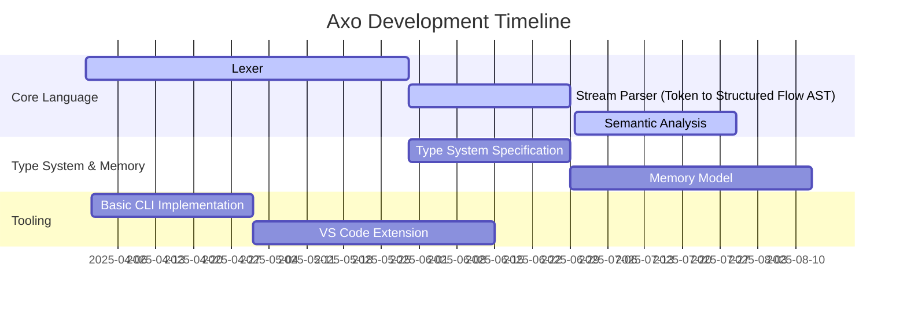

# Axo Development Roadmap

## Overview
Axo is a programming language project following the **River Flow Parsing System** for structured, optimized, and efficient code processing. As a solo developer, this roadmap will guide the structured development of Axo from parsing to execution.

---

## Current Focus (Q2 2025 - Q1 2026)

---

## Core Language Development

### 🌊 **Surface Form (Raw Code) – Lexer**
**Timeline:** March 31, 2025 - May 30, 2025  
**Goal:** Implement a robust **Lexer** to convert raw source code into tokens.  
**Tasks:**
- Define language syntax and token categories.
- Implement a streaming tokenization system.
- Support error handling for malformed tokens.

### 🌊 **Stream Form (Structured Flow) – Parser**
**Timeline:** May 30, 2025 - June 30, 2025  
**Goal:** Develop a **Stream Parser** that builds a structured **AST (Abstract Syntax Tree)** from tokenized input.  
**Tasks:**
- Implement recursive descent parsing.
- Integrate early syntax error detection.
- Lay groundwork for semantic analysis.

### 🌊 **Wave Form (Optimized & Directed Flow) – Semantic Analysis**
**Timeline:** June 30, 2025 - July 30, 2025  
**Goal:** Implement **semantic analysis** to ensure logical consistency.  
**Tasks:**
- Develop a **type checker**.
- Implement **scope resolution**.
- Build **early optimization passes**.

### 🌊 **Deep Form – Type System & Memory Model**
**Type System Specification:** July 30, 2025 - August 30, 2025  
**Memory Model Implementation:** August 15, 2025 - September 30, 2025  
**Goal:** Design a strong, safe **type system** and efficient **memory model**.  
**Tasks:**
- Define primitive and composite types.
- Implement borrowing/lifetime analysis.
- Optimize memory management strategies.

---

## Tooling & Ecosystem

### 🌊 **Basic CLI Implementation**
**Timeline:** April 1, 2025 - May 1, 2025  
**Goal:** Develop a **command-line interface (CLI)** for interacting with the compiler.  
**Tasks:**
- Implement `axo build`, `axo run`, and `axo check` commands.
- Provide minimal error reporting.
- Integrate with core parsing modules.

### 🌊 **VS Code Extension**
**Timeline:** May 1, 2025 - June 15, 2025  
**Goal:** Build a **VS Code extension** for syntax highlighting and basic IDE support.  
**Tasks:**
- Implement syntax highlighting.
- Add error reporting in the editor.
- Support interactive debugging hooks.

---

## Next Steps
After completing the core parsing and semantic analysis stages, the focus will shift to:
- 🌊 **Wave Form (Mid-level IR & Borrow Checking)** – Q4 2025
- 🌊 **Deep Form (Final Optimizations & Code Generation)** – Q1 2026
- 🌊 **Tooling Improvements (Debugger, LSP, More Editor Support)** – Q2 2026

This roadmap keeps development structured and ensures Axo flows smoothly from raw code to a high-performance compiled language.

