# River Flow: The Parsing System

## Overview
The **River Flow Parsing System** models the process of transforming raw code into an executable form using a natural waterway metaphor. Each stage represents a phase in parsing and compilation, moving from the source (raw code) to the ocean (final execution).

---

## Stages of the Parsing System

### 🌊 **Surface Form (Raw Code)**
- Represents the initial, unprocessed code.
- Similar to how a river starts from its source, this stage gathers input.
- At this stage, the program is just a collection of characters with no structure.

#### Components:
- **Tokenizer** – Breaks raw input into meaningful symbols (tokens).
- **Parser** – Organizes tokens into a structured syntax tree.

---

### 🌊 **Stream Form (Structured Flow)**
- Code gains structure and meaning.
- Type checking ensures correctness, like a stream gaining direction.

#### Components:
- **Abstract Syntax Tree (AST)** – A tree structure representing the code’s logic.
- **Type Resolution** – Ensures variables and functions are used correctly.
- **Macro Expansion** – Expands macros and simplifies expressions.

---

### 🌊 **Wave Form (Optimized & Directed Flow)**
- Code is transformed into an intermediate format for better optimization.
- Borrow checking and control flow analysis occur here.

#### Components:
- **Intermediate Representation (IR)** – A simplified version of the code.
- **Control Flow Graph (CFG)** – Structures the logical flow of the program.
- **Borrow Checker** – Ensures safe memory usage.
- **Early Optimizations** – Basic improvements to performance.

---

### 🌊 **Deep Form (Low-Level Optimized Code)**
- The program is nearly ready for execution.
- Further optimizations make it efficient and hardware-friendly.

#### Components:
- **Register Allocation** – Assigns variables to processor registers.
- **Aggressive Optimizations** – Improves execution speed.
- **Instruction Selection** – Converts code into specific hardware instructions.

---

### 🌊 **Sand Form (Final Executable Code)**
- The final version of the program, ready to be executed.
- Code is compiled into machine instructions or interpreted by a virtual machine.

#### Components:
- **Machine Code** – Executable instructions for hardware.
- **Virtual Machine Execution** – Runs the program in a controlled environment.

---

## Additional Elements

### 🌊 **Tide Form (Metadata & Debugging Information)**
- Stores information useful for debugging and profiling.
- Helps track variables and execution steps.

### 🌊 **Reef Form (Plugins & Macros)**
- Provides support for extending functionality.
- Handles custom macros and external plugins.

---

## Flow Diagram

```mermaid
flowchart TD
%% Main Stages
    SFC["Surface Form (SFC) → Raw syntax tree"]
    STR["Stream Form (STR) → High-level IR, typed & scoped"]
    WIR["Wave Form (WIR) → Mid-level IR, control flow"]
    DIR["Deep Form (DIR) → Low-level IR, optimized"]
    ASM["Sand Form (ASM) → Final machine code"]

%% Tooling Extensions
    TID["Tide Form (TID) → Debug & metadata"]
    RFI["Reef Form (RFI) → Plugins & macros"]

%% Sub-levels (Expandable)
subgraph SurfaceDetails[" "]
SFC --> Tokenizer
SFC --> Parser
end

subgraph StreamDetails[" "]
STR --> TypeResolution
STR --> NameResolution
STR --> MacroExpansion
end

subgraph WaveDetails[" "]
WIR --> BorrowCheck
WIR --> CFG["Control Flow Graph"]
WIR --> Opt1["Early Optimizations"]
end

subgraph DeepDetails[" "]
DIR --> RegAlloc
DIR --> Opt2["Aggressive Optimizations"]
DIR --> ISel["Instruction Selection"]
end

%% Pipeline Flow
SFC --> STR --> WIR --> DIR --> ASM

%% Tooling Connections
RFI -.-> STR
RFI -.-> WIR
TID -.-> ASM

%% Styling
classDef stage fill:#e1f5fe,stroke:#039be5,stroke-width:2px
classDef tool fill:#b3e5fc,stroke:#0288d1,dashed
class SFC,STR,WIR,DIR,ASM stage
class TID,RFI tool
```

---