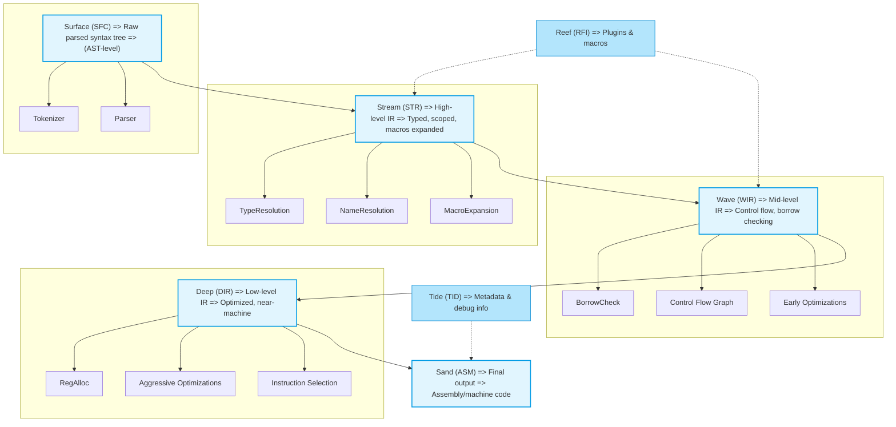

# River Flow: The Parsing System

## Overview
The River Flow Concept represents the stages of a parsing system, where raw code evolves through structured transformations, optimizations, and execution. Each stage mirrors the natural flow of a river, from its source to the ocean.

---

## Stages of the Parsing System

### 🌊 Source Form (Raw Code)
- Represents the initial, unprocessed code.
- Similar to parsing, where raw input is taken in.

#### Components:
- **Lexer** – Breaks input into tokens.
- **Parser** – Constructs a syntax tree.

---

### 🌊 Stream Form (Structured Flow)
- The structured version of the code begins to take shape.
- Type checking is performed to ensure correctness.

#### Components:
- **AST Build** – Forms an Abstract Syntax Tree.
- **Semantic Analysis** – Ensures logical consistency.

---

### 🌊 Current Form (Optimized & Directed Flow)
- The Intermediate Representation (IR) is refined.
- Various optimizations are applied.

#### Components:
- **IR Transform** – Converts AST into IR.
- **Optimization Passes** – Improves performance.

---

### 🌊 Ocean Form (Final Executable Code)
- The final version, ready for execution.
- Code is compiled into machine code or executed in a virtual machine.

#### Components:
- **Machine Code** – Directly executable by hardware.
- **Virtual Machine** – Interprets and runs bytecode.

---

## Flow Diagram

